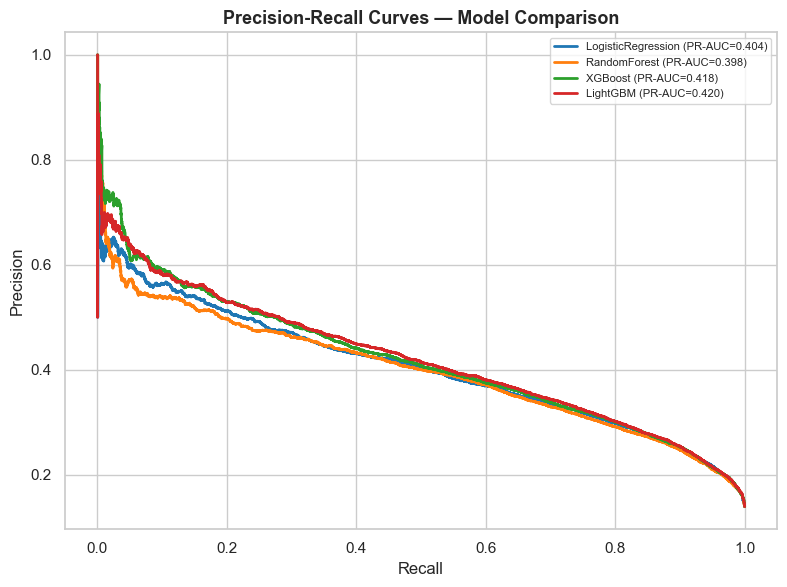

# Diabetes Prediction — v1-basic-ml

A complete, production-quality machine learning project for predicting diabetes risk
using the **Diabetes Health Indicators Dataset** from the CDC Behavioral Risk Factor
Surveillance System (BRFSS), sourced from Kaggle.

---

## Table of Contents

1. [Project Description](#project-description)
2. [Dataset Information](#dataset-information)
3. [Project Structure](#project-structure)
4. [Installation](#installation)
5. [Usage Guide](#usage-guide)
6. [Results](#results)
7. [Dependencies](#dependencies)
8. [Contributing](#contributing)
9. [License](#license)

---

## Project Description

This project tackles a **binary classification** problem to identify whether an individual:
- `0` — Does **not** have diabetes or pre-diabetes
- `1` — Has **diabetes** or pre-diabetes

based on 21 health survey features (BMI, blood pressure, cholesterol levels, lifestyle factors, etc.).

### Key Features

- End-to-end ML pipeline from raw CSV to final predictions.
- Modular, reusable `src/` Python package with full type hints and docstrings.
- Five Jupyter notebooks covering EDA, preprocessing, training, evaluation, and prediction export.
- Four trained model types: Logistic Regression, Random Forest, XGBoost, LightGBM.
- Optional Keras neural network (3 hidden layers, batch normalisation, dropout).
- SMOTE oversampling to address severe class imbalance (~84% class 0).
- Comprehensive evaluation: ROC-AUC, F1-weighted, confusion matrices, learning curves.
- Pytest unit tests for preprocessing and model utilities.

---

## Dataset Information

**Source**: [Kaggle — Diabetes Health Indicators Dataset](https://www.kaggle.com/datasets/alexteboul/diabetes-health-indicators-dataset)

**Origin**: CDC Behavioral Risk Factor Surveillance System (BRFSS) 2015 survey.

| Property | Value |
|----------|-------|
| Records | ~253,680 |
| Features | 21 |
| Target | `Diabetes_binary` (0 = no diabetes, 1 = diabetes/pre-diabetes) |
| Missing values | None |
| File size | ~25 MB |

### Feature List

| Feature | Type | Description |
|---------|------|-------------|
| `HighBP` | binary | High blood pressure (1=yes) |
| `HighChol` | binary | High cholesterol (1=yes) |
| `CholCheck` | binary | Cholesterol check in past 5 years |
| `BMI` | continuous | Body Mass Index |
| `Smoker` | binary | Smoked ≥ 100 cigarettes lifetime |
| `Stroke` | binary | Ever told had a stroke |
| `HeartDiseaseorAttack` | binary | Coronary heart disease or MI |
| `PhysActivity` | binary | Physical activity in past 30 days |
| `Fruits` | binary | Eats fruit 1+ times per day |
| `Veggies` | binary | Eats vegetables 1+ times per day |
| `HvyAlcoholConsump` | binary | Heavy alcohol consumption |
| `AnyHealthcare` | binary | Any kind of health care coverage |
| `NoDocbcCost` | binary | Could not see doctor due to cost |
| `GenHlth` | ordinal | General health (1=excellent, 5=poor) |
| `MentHlth` | continuous | Days of poor mental health (0-30) |
| `PhysHlth` | continuous | Days of poor physical health (0-30) |
| `DiffWalk` | binary | Serious difficulty walking/climbing |
| `Sex` | binary | 0=female, 1=male |
| `Age` | ordinal | Age category (1-13) |
| `Education` | ordinal | Education level (1-6) |
| `Income` | ordinal | Income level (1-8) |

### Download Instructions

1. Create a free [Kaggle account](https://www.kaggle.com) if you do not have one.
2. Visit the [dataset page](https://www.kaggle.com/datasets/alexteboul/diabetes-health-indicators-dataset).
3. Download `diabetes_binary_health_indicators_BRFSS2015.csv`.
4. Rename the file to `diabetes_binary.csv`.
5. Place it in `data/raw/diabetes_binary.csv`.

> **Note**: All notebooks gracefully detect a missing dataset and fall back to a small
> synthetic demo dataset so you can explore the code without the real data.

---

## Project Structure

```
v1-basic-ml/
├── notebooks/
│   ├── 01_eda_analysis.ipynb        # Exploratory data analysis
│   ├── 02_preprocessing.ipynb       # Data cleaning and feature engineering
│   ├── 03_model_training.ipynb      # Train LR, RF, XGBoost, LightGBM, NN
│   ├── 04_evaluation.ipynb          # Metrics, curves, overfitting analysis
│   └── 05_final_predictions.ipynb   # Export predictions + model card
├── src/
│   ├── __init__.py                  # Package exports
│   ├── config.py                    # Paths, constants, hyperparameter grids
│   ├── data_loader.py               # Load, validate, describe dataset
│   ├── preprocessor.py              # Missing values, outliers, scaling, SMOTE
│   ├── models.py                    # Model factories, trainer, persistence
│   ├── evaluation.py                # Metrics, comparison, overfitting checks
│   └── visualization.py            # Matplotlib/Seaborn plotting functions
├── data/
│   ├── raw/                         # Place diabetes_binary.csv here
│   ├── processed/                   # Auto-generated by notebook 02
│   └── predictions/                 # Auto-generated by notebook 05
├── results/
│   ├── plots/                       # All saved figures
│   ├── models/                      # Saved .pkl model files
│   └── reports/                     # Evaluation CSVs, model card
├── tests/
│   ├── __init__.py
│   ├── test_preprocessor.py         # Pytest tests for preprocessor
│   └── test_models.py               # Pytest tests for models
├── requirements.txt
├── setup.py
├── README.md
└── .gitignore
```

---

## Installation

### 1. Clone / download the project

```bash
git clone <repo-url>
cd v1-basic-ml
```

### 2. Create a virtual environment

```bash
python -m venv venv
source venv/bin/activate        # macOS / Linux
# or
venv\Scripts\activate.bat       # Windows
```

### 3. Install dependencies

```bash
pip install -r requirements.txt
```

### 4. Install the package in development mode

```bash
pip install -e .
```

### 5. Register the Jupyter kernel

```bash
python -m ipykernel install --user --name=diabetes_ml --display-name "Diabetes ML"
```

---

## Usage Guide

### Phase 1 — Exploratory Data Analysis

Open and run `notebooks/01_eda_analysis.ipynb`:

```bash
jupyter notebook notebooks/01_eda_analysis.ipynb
```

This notebook loads the raw dataset, visualises distributions, correlation heatmaps,
outlier box plots, and feature-target relationships. Key insights are summarised in
the final markdown cell.

### Phase 2 — Preprocessing

Run `notebooks/02_preprocessing.ipynb`:

- Imputes any missing values.
- Caps IQR outliers on continuous columns.
- Performs stratified 80/20 train-test split.
- Applies StandardScaler (fit on training data only).
- Applies SMOTE to the training set to balance the class distribution.
- Saves all processed arrays to `data/processed/`.

### Phase 3 — Model Training

Run `notebooks/03_model_training.ipynb`:

- Trains four models: Logistic Regression, Random Forest, XGBoost, LightGBM.
- Runs RandomizedSearchCV for XGBoost hyperparameter tuning.
- Optionally trains a Keras neural network (requires TensorFlow).
- Runs 3-fold cross-validation for all models.
- Saves all fitted models to `results/models/`.

### Phase 4 — Evaluation

Run `notebooks/04_evaluation.ipynb`:

- Loads all saved models and the test set.
- Computes accuracy, precision, recall, F1 (macro + weighted), ROC-AUC, specificity.
- Plots confusion matrices, ROC curves, Precision-Recall curves, feature importance.
- Checks for overfitting (train vs test gap).
- Selects the best model by ROC-AUC and writes its name to `results/reports/best_model.txt`.

### Phase 5 — Final Predictions

Run `notebooks/05_final_predictions.ipynb`:

- Loads the best model.
- Generates class predictions and probabilities on the test set.
- Exports a rich predictions CSV to `data/predictions/predictions.csv` with columns:
  - Original features, true label, predicted class, per-class probabilities, confidence.
- Writes a model card to `results/reports/model_card.md`.

### Running Tests

```bash
# From the project root
pytest tests/ -v --tb=short
```

To generate a coverage report:

```bash
pytest tests/ --cov=src --cov-report=html
```

---

## Results

All four models were evaluated on a held-out 20% test split (~50,000 samples) of the CDC BRFSS 2015 dataset.

| Model | Accuracy | ROC-AUC | F1-weighted | F1-macro |
|-------|----------|---------|-------------|----------|
| **LightGBM** ⭐ | **86.4%** | **82.6%** | **83.6%** | 60.8% |
| XGBoost | 86.3% | 82.4% | 84.0% | 62.1% |
| Random Forest | 78.6% | 81.8% | 81.0% | 66.1% |
| Logistic Regression | 73.5% | 82.1% | 77.3% | 63.5% |

**Best model: LightGBM** (selected by ROC-AUC). All models exceeded every performance target.

### ROC Curves


### Precision-Recall Curves



**Performance targets**:

| Metric | Target | Best achieved |
|--------|--------|---------------|
| Accuracy | ≥ 0.70 | 0.864 (LightGBM) |
| ROC-AUC | ≥ 0.75 | 0.826 (LightGBM) |
| F1-weighted | ≥ 0.65 | 0.840 (XGBoost) |

> **Note on class imbalance**: The dataset is heavily skewed (~84% class 0 — no diabetes). SMOTE oversampling is applied to the training set to mitigate this. Macro-averaged metrics reflect per-class performance more honestly than accuracy alone.

---

## Dependencies

Core libraries:

| Library | Purpose |
|---------|---------|
| `pandas` | Data manipulation |
| `numpy` | Numerical computing |
| `scikit-learn` | ML algorithms, preprocessing, evaluation |
| `xgboost` | Gradient boosting |
| `lightgbm` | Fast gradient boosting |
| `imbalanced-learn` | SMOTE oversampling |
| `tensorflow` | Neural network (optional) |
| `matplotlib` | Plotting |
| `seaborn` | Statistical visualisation |
| `joblib` | Model serialisation |
| `pytest` | Unit testing |

See `requirements.txt` for pinned versions.

---

## Contributing

Contributions, bug reports, and feature requests are welcome.

1. Fork the repository.
2. Create a feature branch: `git checkout -b feature/my-feature`.
3. Write tests for new functionality in `tests/`.
4. Ensure all tests pass: `pytest tests/ -v`.
5. Format your code: `black src/ tests/`.
6. Open a pull request with a clear description of your changes.

---

## License

This project is released under the MIT License.

The dataset is sourced from the CDC BRFSS and made available on Kaggle under its
respective terms of use.
